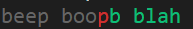
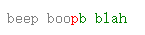

# jsdiff

[](http://travis-ci.org/kpdecker/jsdiff)
[](https://saucelabs.com/u/jsdiff)

A javascript text differencing implementation.

Based on the algorithm proposed in
["An O(ND) Difference Algorithm and its Variations" (Myers, 1986)](http://citeseerx.ist.psu.edu/viewdoc/summary?doi=10.1.1.4.6927).

## Installation

    npm install diff

or

    bower install jsdiff


## API

* `JsDiff.diffChars(oldStr, newStr[, callback])` - diffs two blocks of text, comparing character by character.

    Returns a list of change objects (See below).

* `JsDiff.diffWords(oldStr, newStr[, callback])` - diffs two blocks of text, comparing word by word, ignoring whitespace.

    Returns a list of change objects (See below).

* `JsDiff.diffWordsWithSpace(oldStr, newStr[, callback])` - diffs two blocks of text, comparing word by word, treating whitespace as significant.

    Returns a list of change objects (See below).

* `JsDiff.diffLines(oldStr, newStr[, callback])` - diffs two blocks of text, comparing line by line.

    Returns a list of change objects (See below).

* `JsDiff.diffTrimmedLines(oldStr, newStr[, callback])` - diffs two blocks of text, comparing line by line, ignoring leading and trailing whitespace.

    Returns a list of change objects (See below).

* `JsDiff.diffSentences(oldStr, newStr[, callback])` - diffs two blocks of text, comparing sentence by sentence.

    Returns a list of change objects (See below).

* `JsDiff.diffCss(oldStr, newStr[, callback])` - diffs two blocks of text, comparing CSS tokens.

    Returns a list of change objects (See below).

* `JsDiff.diffJson(oldObj, newObj[, callback])` - diffs two JSON objects, comparing the fields defined on each. The order of fields, etc does not matter in this comparison.

    Returns a list of change objects (See below).

* `JsDiff.createTwoFilesPatch(oldFileName, newFileName, oldStr, newStr, oldHeader, newHeader)` - creates a unified diff patch.

    Parameters:
    * `oldFileName` : String to be output in the filename section of the patch for the removals
    * `newFileName` : String to be output in the filename section of the patch for the additions
    * `oldStr` : Original string value
    * `newStr` : New string value
    * `oldHeader` : Additional information to include in the old file header
    * `newHeader` : Additional information to include in thew new file header
    * `options` : An object with options. Currently, only `context` is supported and describes how many lines of context should be included.

* `JsDiff.createPatch(fileName, oldStr, newStr, oldHeader, newHeader)` - creates a unified diff patch.

    Just like JsDiff.createTwoFilesPatch, but with oldFileName being equal to newFileName.

    
* `JsDiff.structuredPatch(oldFileName, newFileName, oldStr, newStr, oldHeader, newHeader, options)` - returns an object with an array of hunk objects.

    This method is similar to createTwoFilesPatch, but returns a data structure 
    suitable for further processing. Parameters are the same as createTwoFilesPatch. The data structure returned may look like this:

    ```js
    {
      oldFileName: 'oldfile', newFileName: 'newfile',
      oldHeader: 'header1', newHeader: 'header2',
      hunks: [{
        oldStart: 1, oldLines: 3, newStart: 1, newLines: 3,
        lines: [' line2', ' line3', '-line4', '+line5', '\\ No newline at end of file'],
      }]
    }
    ```

* `JsDiff.applyPatch(oldStr, diffStr)` - applies a unified diff patch.

    Return a string containing new version of provided data.

* `convertChangesToXML(changes)` - converts a list of changes to a serialized XML format


All methods above which accept the optional callback method will run in sync mode when that parameter is omitted and in async mode when supplied. This allows for larger diffs without blocking the event loop.

### Change Objects
Many of the methods above return change objects. These objects are consist of the following fields:

* `value`: Text content
* `added`: True if the value was inserted into the new string
* `removed`: True of the value was removed from the old string

Note that some cases may omit a particular flag field. Comparison on the flag fields should always be done in a truthy or falsy manner.

## Examples

Basic example in Node

```js
require('colors')
var jsdiff = require('diff');

var one = 'beep boop';
var other = 'beep boob blah';

var diff = jsdiff.diffChars(one, other);

diff.forEach(function(part){
  // green for additions, red for deletions
  // grey for common parts
  var color = part.added ? 'green' :
    part.removed ? 'red' : 'grey';
  process.stderr.write(part.value[color]);
});

console.log()
```
Running the above program should yield



Basic example in a web page

```html
<pre id="display"></pre>
<script src="diff.js"></script>
<script>
var one = 'beep boop';
var other = 'beep boob blah';

var diff = JsDiff.diffChars(one, other);

diff.forEach(function(part){
  // green for additions, red for deletions
  // grey for common parts
  var color = part.added ? 'green' :
    part.removed ? 'red' : 'grey';
  var span = document.createElement('span');
  span.style.color = color;
  span.appendChild(document
    .createTextNode(part.value));
  display.appendChild(span);
});
</script>
```

Open the above .html file in a browser and you should see



**[Full online demo](http://kpdecker.github.com/jsdiff)**

## Compatibility

[](https://saucelabs.com/u/jsdiff)

jsdiff supports all ES3 environments with some known issues on IE8 and below. Under these browsers some diff algorithms such as word diff and others may fail due to lack of support for capturing groups in the `split` operation.

## License

See [LICENSE](https://github.com/kpdecker/jsdiff/blob/master/LICENSE).
